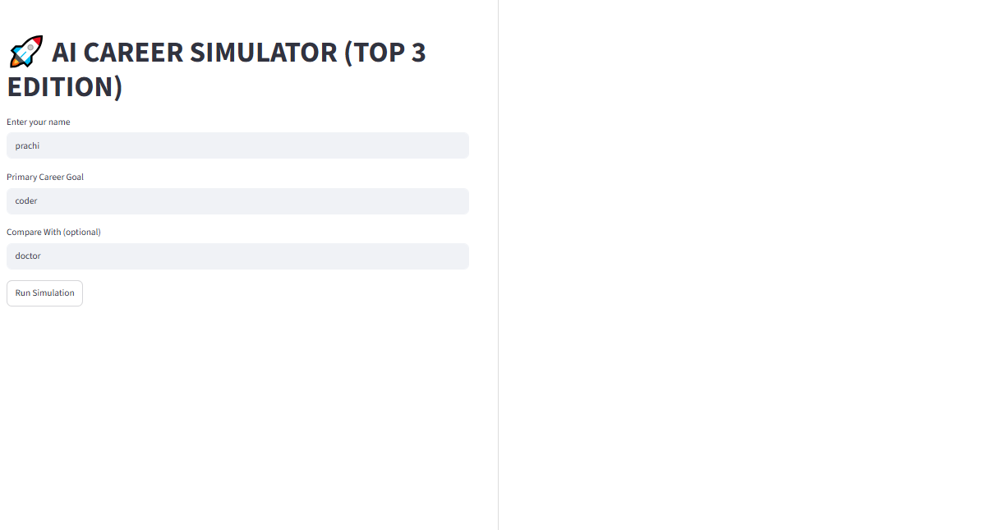
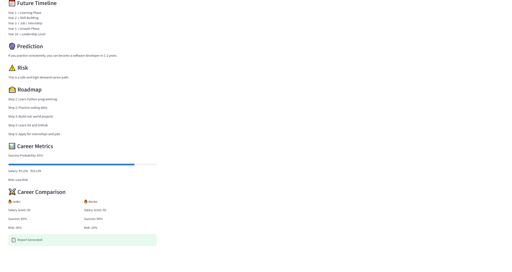
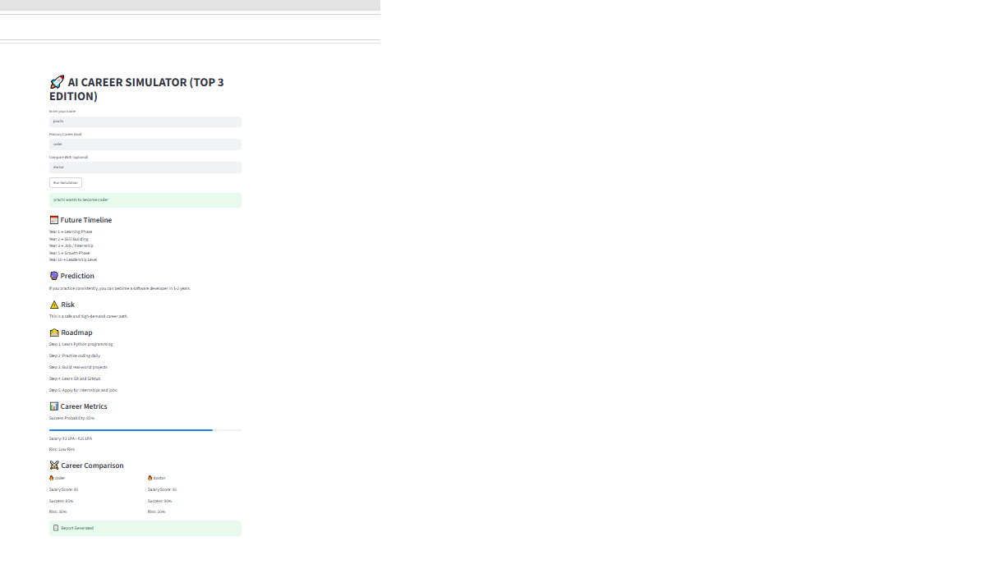
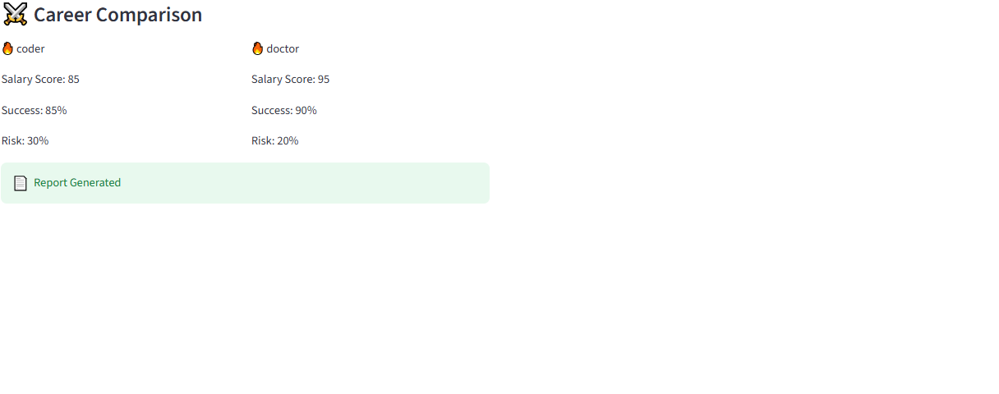

# 🚀 AI CAREER SIMULATOR (TOP 3 EDITION)

An AI-powered career planning and future simulation tool built with Python and Streamlit.

## Features

- 🔮 Future Career Prediction
- ⚠️ Risk Analysis
- 🛣️ Personalized Career Roadmap
- 📊 Career Metrics
- ⚔️ Career Comparison
- 📄 Report Generation

---

# 📸 Screenshots

## Input Page



---

## Future Timeline & Prediction



---

## Career Comparison



---

## Career Metrics + Comparison



---

# 🛠️ Tech Stack

- Python
- Streamlit

---

# ▶️ Run Project

```bash
streamlit run app_ui.py
```
